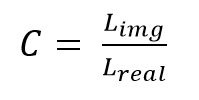
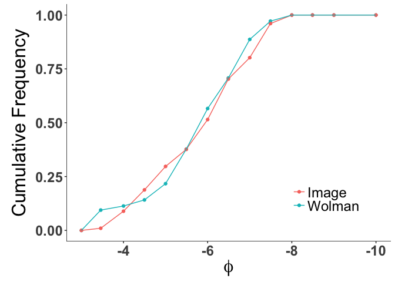

grainsizeR
================
David Tavernini
2017-02-12

Introduction
------------

This is a package developed by David Tavernini for a term project in GEOB 503. This package contains all the tools necessary to extract grain sizes from images, digitally sieve grain size measurements, and gather descriptive statistics on sieved data. For questions, comments, or issues please refer to the discussion tab or email me at <taverninid@gmail.com>.

Requirements
------------

This app has two dependencies:

1.  Shiny: can be installed from CRAN

2.  [videoplayR](http://rpubs.com/sjmgarnier/videoplayR)

System requirements:

1.  Mac or Linux operating system for full functionality. Shiny app cannot be accessed on PC due to videoplayR only available for Mac and Linux

2.  R(v3.3.2). Earlier versions may work

Features
--------

The features within this package allow for a self-contained workflow of grain size extraction, data sieving, descriptive statistics and probability distribution fitting. An example workflow would be:


This package also contains two datasets to test the functionality of this package:

-   `elwha_img` which is a list of grain sizes extracted from an image of a gravel bar adjacent to the Elwha River
-   `elwha_wol` which is the corresponding Wolman pebble count for the gravel bar in `elwha_img`.

Each step in the above workflow is detailed further below:

### 1.0 Grain Size Extraction

Once images are preprocessed to correct for lens distortion, cropping, etc., the images will be ready for mport. Previously, I have used [GIMP](https://www.gimp.org/downloads/) to do these corrections, especially perspective transform.

Open the Shiny app using `run.grainsizeR` and follow the step-by-step protocol on the left hand side. This app allows for the scaling measurements to be included in the grain size collection and will output a .csv of the collected grain sizes. Random point plotting will occur until the user is finished collecting data. To collect point measurments, determine b-axis of grain indiciated by the randomly plotted yellow point. Click on one end of the b-axis line and double click to determine other point. Once clicks are finalized (coordinates shown on the left), click "Record Measurement" and the app will refresh with a new point.

If stones are too small, make the measurement to the best of your ability and flag the measurement using the "Too Small" button. Within the final dataframe, a separate column with binary (0 = No, 1 = Yes) of flagged measurements for manual editing of data.

If points are outside the measurement boundary or if the point resides on the same grain as a previously plotted point, click "Out of Interest" and a new point will be plotted without observation.

*Behind the Scenes*

Scale calculations are derived from plotting two points in the image indicating distances known a priori or measurement tools present in the image (e.g. ruler).

The length *L*<sub>*i**m**g*</sub> between the two points plotted on the image during the scaling process is calculated using Pythagorean Theorem. Using an entered value of real world length *L*<sub>*r**e**a**l*</sub>, a scaling coefficient is calculated by dividing the image line length *L*<sub>*i**m**g*</sub> by the real-world length *L*<sub>*r**e**a**l*</sub>



Each b-axis length is measured between two points on the image and converted to real world units by dividing the X and Y distance between the two points by the horizontal and vertical scaling coefficients, respectively. The X and Y distance between the two points is converted to euclidian distance using Pythagorean Theorem.

### 2.0 Data Sieving

Following grain size collection (via image or pebble count), a vector of grain sizes can be inputted to `sieve.mm()` or `sieve.phi ()` (depending on units) to sieve the data into counts. In these functions, individual measurements are placed into the appropriate sieve classes based on the input size classes. These functions will return a dataframe with size class and the number of grains sieved by that size class.

The statistical functions developed in this package rely on graphical geometric or algebraic methods and thus require a cumulative distribution to be generated. Therefore, binning measurements into sieve classes and the calculation of a cumulative distribution is imperative to accurately measure the percentile grain sizes for statistical analysis.

### 3.0 Descriptive Statistics

**Size Distributions**

With sieved data, size distributions can be determined by `cumudist()` which takes a vector of counts according to ascending size and calculates the proportion of counts less than that entry. In other words, sums the number of values of indices less than each index value. This method allows for the calculation of grain sizes according specific percentiles which is a critical component in the algebraic statistical equations.

**Percentile Values**

`stat.dx()` is a quick function to extract the grain size for a desired percentile in either phi or mm units.

**Central Tendency**

-   Median: Using `stat.dx(d = 0.5)` allows for the measurement of the grain size of the 50th percentile (a.k.a. the median grain size).

-   Mean: `stat.mean()` provides numerous approaches to calculating algebraic or geometric means from a cumulative distribution.

**Distribution Shape**

-   Sorting: `stat.sorting()`: algebraic methods for calculating sorting coefficient of a grain size distribution

-   Skewness: `stat.skew()`: algebraic and geometric methods for calculating various skewness indices of a grain size distribution

-   Kurtosis: `stat.kurt()`: algebraic and geometric methods for calculating various kurtosis indices of a grain size distribution

### 4.0 Fitting probability distributions

*Still under development*

Example workflow
----------------

**Central Tendency and percentile comparison**

``` r
# Load example datasets

img <- elwha_img
wol <- elwha_wol


# Sieve img data

img <- sieve.mm(img$gsize_cm*10)
img <- img[-1,] #remove 0mm category due to match wolman
#wol already sieved

# Calculate cumulative distribution

img$prop <- cumudist(img$count)
wol$prop <- cumudist(wol$Count)

######################
# Central Tendencies + percentiles
#########################
# Calculate statistics
# Convert to phi
img$phi <- -log2(img$size.mm)
wol$phi <- -log2(wol$Size.class)

## calculate mean using algebraic phi scale and backtransform
img_mean <- 2^-stat.mean(img$phi, img$prop, units = "phi", method = "mccam")
wol_mean <- 2^-stat.mean(wol$phi, wol$prop, units = "phi", method = "mccam")

## calculate sorting based on two methods
img_sort_fw <- stat.sorting(img$phi, img$prop, units = "phi", method = "fw")
img_sort_inm <- stat.sorting(img$phi, img$prop, units = "phi", method = "inm")
wol_sort_fw <- stat.sorting(wol$phi, wol$prop, units = "phi", method = "fw")
wol_sort_inm <- stat.sorting(wol$phi, wol$prop, units = "phi", method = "inm")
desc_comp <- data.frame("Statistic" = c("Mean", 
                                        "Sorting: Inman",
                                        "Sorting: Folkward",
                                        "D16", 
                                        "D25", 
                                        "D50", 
                                        "D75", 
                                        "D84"),
                        "Image" = c(img_mean,
                                    img_sort_inm,
                                    img_sort_fw,
                                    ## Backtransform measurements of percentile to present in mm
                                    2^(-stat.dx(img$phi, img$prop, d = 0.16, phi = TRUE)),
                                    2^(-stat.dx(img$phi, img$prop, d = 0.25, phi = TRUE)),
                                    2^(-stat.dx(img$phi, img$prop, d = 0.50, phi = TRUE)),
                                    2^(-stat.dx(img$phi, img$prop, d = 0.75, phi = TRUE)),
                                    2^(-stat.dx(img$phi, img$prop, d = 0.84, phi = TRUE))
                        ),
                                    
                        "Wolman" = c(wol_mean,
                                     wol_sort_inm,
                                     wol_sort_fw,
                                     2^(-stat.dx(wol$phi, wol$prop, d = 0.16, phi = TRUE)),
                                     2^(-stat.dx(wol$phi, wol$prop, d = 0.25, phi = TRUE)),
                                     2^(-stat.dx(wol$phi, wol$prop, d = 0.50, phi = TRUE)),
                                     2^(-stat.dx(wol$phi, wol$prop, d = 0.75, phi = TRUE)),
                                     2^(-stat.dx(wol$phi, wol$prop, d = 0.84, phi = TRUE))
                                     )
)

knitr::kable(desc_comp)
```

| Statistic         |       Image|      Wolman|
|:------------------|-----------:|-----------:|
| Mean              |   54.573128|   52.409615|
| Sorting: Inman    |    1.380649|    1.123084|
| Sorting: Folkward |   -1.254943|   -1.186187|
| D16               |   20.488573|   24.610114|
| D25               |   27.537689|   34.326810|
| D50               |   61.629778|   56.577189|
| D75               |  106.390305|   97.829908|
| D84               |  138.913668|  116.755517|

**Visualization of Distributions**

``` r
## Generate distribution curves
comp_dist_prop<- data.frame(
  "size_mm" = img$size.mm,
  "wol_prop" = wol$prop,
  "img_prop" = img$prop
)

comp_dist_prop_long <- gather(comp_dist_prop, type, "value", 2:3)

## Generate distribution curves
comp_dist_prop<- data.frame(
  "size_mm" = img$size.mm,
  "wol_prop" = wol$prop,
  "img_prop" = img$prop
)

comp_dist_prop_long <- gather(comp_dist_prop, type, "value", 2:3)

# normal
nor_dist_comp <- ggplot(data = comp_dist_prop_long) + 
  #geom_hline(yintercept = seq(0, 1, by = 0.1), color = "grey90") +
  geom_point(aes(x = size_mm, y = value, color = type)) +
  geom_line(aes(x = size_mm, y = value, color = type)) +
  xlab("Grain Size (mm)") +
  ylab("Cumulative Frequency") +
  scale_color_discrete(name = "",
                       breaks = c("img_prop", "wol_prop"),
                       labels = c("Image", "Wolman"))+
  theme_dtavern

# In phi units
comp_dist_prop_long$phi <- -log2(comp_dist_prop_long$size_mm)
nor_dist_comp_phi <- ggplot(data = comp_dist_prop_long) + 
  #geom_hline(yintercept = seq(0, 1, by = 0.1), color = "grey90") +
  geom_point(aes(x = phi, y = value, color = type)) +
  geom_line(aes(x = phi, y = value, color = type)) +
  xlab(expression(phi)) +
  ylab("Cumulative Frequency") +
  scale_x_reverse() +
  scale_color_discrete(name = "",
                       breaks = c("img_prop", "wol_prop"),
                       labels = c("Image", "Wolman"))+
  theme_dtavern


nor_dist_comp
```


``` r
nor_dist_comp_phi
```



**Distribution shape: Skewness & Kurtosis**

``` r
## Measure distribution shape with stat.kurt and stat.skew with two methods

#####################
## Skewness

## According to Warren 1974:
sk_img_war <- -1*stat.skew(img$phi, img$prop, units = "phi", method = "war")
sk_wol_war <- -1*stat.skew(wol$phi, wol$prop, units = "phi", method = "war")

## According to Gordon:
sk_img_gor <- -1*stat.skew(img$phi, img$prop, units = "phi", method = "gor")
sk_wol_gor <- -1*stat.skew(wol$phi, wol$prop, units = "phi", method = "gor")

####################
## Kurtosis

# According to Folk and Ward 1957
ku_img_fw <- stat.kurt(img$phi, img$prop, units = "phi", method = "fw")
ku_wol_fw <- stat.kurt(wol$phi, wol$prop, units = "phi", method = "fw")

# According to Inman 1952
ku_img_in <- stat.kurt(img$phi, img$prop, units = "phi", method = "inm")
ku_wol_in <- stat.kurt(wol$phi, wol$prop, units = "phi", method = "inm")

#############
## Distribution shape

dist_comp <- data.frame("Method" = c("Image", "Wolman"),
                        "Skewness (Warren 1974)" = c(sk_img_war, sk_wol_war),
                        "Skewness (Gordon 1996)" = c(sk_img_gor, sk_wol_gor),
                        "Kurtosis (Folk/Ward 1957)" = c(ku_img_fw, ku_wol_fw),
                        "Kurtosis (Inman 1952)" = c(ku_img_in, ku_wol_in))
knitr::kable(dist_comp)
```

| Method |  Skewness..Warren.1974.|  Skewness..Gordon.1996.|  Kurtosis..Folk.Ward.1957.|  Kurtosis..Inman.1952.|
|:-------|-----------------------:|-----------------------:|--------------------------:|----------------------:|
| Image  |               0.1690980|               0.1572381|                  0.7832485|               0.349540|
| Wolman |               0.1601571|               0.1716082|                  1.1182538|               0.835419|
