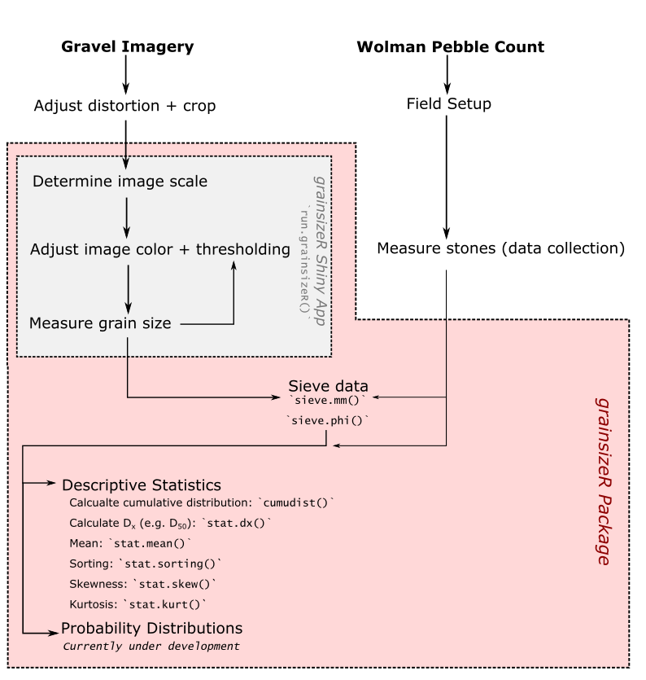

grainsizeR
================
David Tavernini
2017-02-12

Introduction
------------

This is a package developed by David Tavernini for a term project in GEOB 503. This package contains all the tools necessary to extract grain sizes from images, digitally sieve grain size measurements, gather descriptive statistics on sieved data.

Requirements
------------

This app has two dependencies:

1.  Shiny: can be installed from CRAN

2.  [videoplayR](http://rpubs.com/sjmgarnier/videoplayR)

System requirements:

1.  Mac or Linux operating system for full functionality. Shiny app cannot be accessed on PC due to videoplayR only available for Mac and Linux

2.  R(v3.3.2). Earlier versions may work

Features
--------

The features within this package allow for a self-contained workflow of grain size extraction, data sieving, descriptive statistics and probability distribution fitting. An example workflow would be:

### 1.0 Grain Size Extraction

Once images are preprocessed to correct for lens distortion, cropping, etc., the images will be ready for mport. Previously, I have used [GIMP](https://www.gimp.org/downloads/) to do these corrections, especially perspective transform.

Open the Shiny app using `run.grainsizeR` and follow the step-by-step protocol on the left hand side. This app allows for the scaling measurements to be included in the grain size collection and will output a .csv of the collected grain sizes. Random point plotting will occur until the user is finished collecting data. To collect point measurments, determine b-axis of grain indiciated by the randomly plotted yellow point. Click on one end of the b-axis line and double click to determine other point. Once clicks are finalized (coordinates shown on the left), click "Record Measurement" and the app will refresh with a new point.

If stones are too small, make the measurement to the best of your ability and flag the measurement using the "Too Small" button. Within the final dataframe, a separate column with binary (0 = No, 1 = Yes) of flagged measurements for manual editing of data.

If points are outside the measurement boundary or if the point resides on the same grain as a previously plotted point, click "Out of Interest" and a new point will be plotted without observation.

*Behind the Scenes*

Scale calculations are derived from plotting two points in the image indicating distances known a priori or measurement tools present in the image (e.g. ruler).

The length between the two points plotted on the image during the scaling process *L**i**m**g* is calculated using Pythagorean Theorem $L\_{img} = \\sqrt{(x\_{max} - x\_{min})^2 + (y\_{max} - y\_{min})^2}$ and this length is converted to a scaling coefficient by dividing the image line length *L**i**m**g* by the real-world length *L**r**e**a**l*

$$C = \\frac{L\_{img}}{L\_{real}}$$

Each b-axis length is calculated using the formula above and converted to real world units by dividing by the horizontal and vertical scaling units for X and Y, respectively.

### 2.0 Data Sieving

Following grain size collection (via image or pebble count), a vector of grain sizes can be inputted to `sieve.mm()` or `sieve.phi` (depending on units) to sieve the data into counts. This package has yet to develop functions for unsieved data, but using these functions will allow for smooth transition into future functions.

In these functions, individual measurements are placed into the appropriate sieve classes based on the input arguments. These functions will return a dataframe with size class and the number of grains sieved by that size class.

### 3.0 Descriptive Statistics

**Size Distributions**

With sieved data, size distributions can be determined by `prop.lessthan()` which takes a vector of counts according to ascending size and calculates the proportion of counts less than that entry. In other words, sums the number of values of indices less than each index value.

**Percentile Values**

Using the size distribution data output from `prop.lessthan()`, set arguments for sieve size and proportion accordingly, choose desired percentile value and results will be a value of grain size according to percentile value.

### 4.0 Model

Example workflow
----------------
